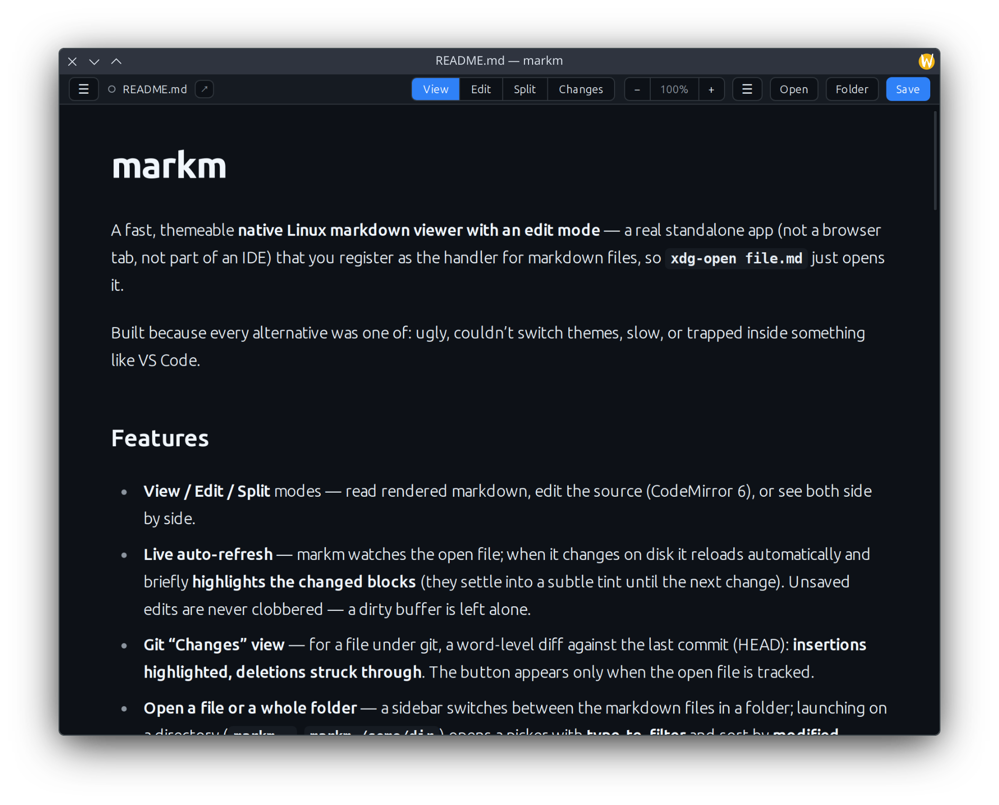

<h1 align="center">markm</h1>

<p align="center">
  <b>The markdown viewer Linux never had.</b><br>
  A real standalone app — not a browser tab, not an IDE panel — that opens in a
  blink, gets out of your way, and looks good doing it.
</p>

<p align="center">
  
  
  
  
</p>



## TL;DR

**A 1.8 MB native markdown viewer + editor for Linux.** `markm file.md` opens it
instantly and gives your shell prompt straight back; `Esc` closes it. Sixteen
themes restyle *everything* — chrome, page, code, editor. It also edits
(CodeMirror 6), reloads live when the file changes on disk and highlights what
changed, and shows a **git word-diff** against HEAD. No Electron, no browser tab,
no IDE.

```bash
git clone https://github.com/galvani/markm && cd markm
pnpm install && pnpm build
pnpm exec neu build --release
scripts/install.sh          # ~/.local + MIME + .desktop

xdg-open README.md          # markm is now your markdown handler
```

<sub>Jump to: <a href="#why-markm">Why</a> · <a href="#everything-else">Features</a> ·
<a href="#keyboard-shortcuts">Shortcuts</a> · <a href="#build--install-as-a-real-linux-app">Install</a> ·
<a href="#develop">Develop</a></sub>

---

## Why markm

Every other option was ugly, slow, stuck on one theme, or trapped inside VS Code.
markm gets four things right:

> **⚡ Throwaway by design** — one command to open, `Esc` to close, prompt never blocked.
>
> **🎨 Sixteen themes, applied everywhere** — chrome, page, code *and* editor, together.
>
> **✍️ An editor and a git diff too** — live reload highlights what changed; **Changes** word-diffs against HEAD.
>
> **🪶 1.8 MB, native, instant** — system WebKitGTK. No Chromium, no Electron.

### The sixteen

| Dark | Light |
|------|-------|
| Dark · Dracula · Nord · Tokyo Night · One Dark · Monokai · Catppuccin Mocha · Everforest · Gruvbox Dark · Solarized Dark · Rosé Pine | Light · Catppuccin Latte · Gruvbox Light · Solarized Light · Rosé Pine Dawn |

---

## Everything else

- **Browse** — opens the current file's folder, that file preselected. Type to filter.
- **Code blocks** — highlighted in 15 languages, themed, with a Copy button.
- **Images** — local ones render inline.
- **Links** — external open in your browser, local `.md` open here, `#anchors` scroll.
- **Reading font** — System / Sans / Serif / Mono, auto-scaling with window width.
- **Zoom** — `Ctrl` `+`/`-`/`0`, or `Ctrl` + wheel. The toolbar stays put.
- **Remembers** — theme, font, zoom, mode, folder, scroll *and* window size, per file.
- **Native** — `xdg-open` / "Open With" via a `.desktop` entry + MIME association.

## Keyboard shortcuts

| Shortcut         | Action                        |
|------------------|-------------------------------|
| `Ctrl` `E`       | Toggle edit/view              |
| `Ctrl` `S`       | Save                          |
| `Ctrl` `O`       | Open                          |
| `Ctrl` `+` / `-` | Zoom in / out                 |
| `Ctrl` `0`       | Reset zoom                    |
| `Esc`            | Close (in View mode / picker) |

## Tech stack

- **[Neutralino.js](https://neutralino.js.org/)** — native shell that uses the
  OS WebKitGTK (no bundled runtime). See [SPEC.md](SPEC.md) for why this over
  Tauri/Electron.
- **[Svelte 5](https://svelte.dev/)** + **[Vite](https://vite.dev/)** — frontend.
- **[CodeMirror 6](https://codemirror.net/)** — source editor.
- **[markdown-it](https://github.com/markdown-it/markdown-it)** — renderer.
- **[diff](https://github.com/kpdecker/jsdiff)** — word-level diff for the Changes view.

## Develop

Requires Node (via nvm) and pnpm.

```bash
pnpm install
pnpm build        # compile the Svelte frontend into dist/
pnpm app          # launch the native window (neu run)
# or in one step:
pnpm start
```

`pnpm dev` runs `vite build --watch` for an iterative loop (rebuilds dist/ on
change; relaunch `pnpm app` to pick changes up).

## Build & install (as a real Linux app)

```bash
pnpm build
pnpm exec neu build --release     # -> dist/markm/markm-linux_x64 + resources.neu
scripts/install.sh                # installs under ~/.local, registers MIME + .desktop
```

Then `xdg-open any.md` (or a file manager, or "Open With") launches markm.
Remove with `scripts/uninstall.sh`.

<details>
<summary><b>Build a macOS <code>.app</code></b></summary>

Run this on macOS:

```bash
pnpm install
scripts/package-macos-app.sh          # universal app: dist/macos/markm.app
# or: pnpm run package:macos-app
# or: scripts/package-macos-app.sh arm64
# or: scripts/package-macos-app.sh x64
open dist/macos/markm.app
```

The script builds the Svelte bundle, runs `neu build --release`, creates
`appIcon.icns` from `public/icons/appIcon.png` with macOS `sips`/`iconutil`, and
wraps the Neutralino binary in a normal `markm.app/Contents/...` bundle. It is
not signed or notarized.

</details>

<details>
<summary><b>Redistribution</b></summary>

`neu build` produces the portable binary + `resources.neu` bundle — the basis
for an AppImage / `.deb` / tarball. `scripts/package-macos-app.sh` produces a
macOS `.app` bundle. Node is **only** a build-time tool; it is never shipped. See
[SPEC.md](SPEC.md#distribution).

</details>

## Documentation

- [BUILD.md](BUILD.md) — Linux install and macOS `.app` build steps.
- [SPEC.md](SPEC.md) — what markm is, the architecture, and why these choices.
- [JOURNAL.md](JOURNAL.md) — decisions and gotchas, newest first.

## License

[MIT](LICENSE) — open source. Built by [Jan Kozak](https://galvani.github.io).
